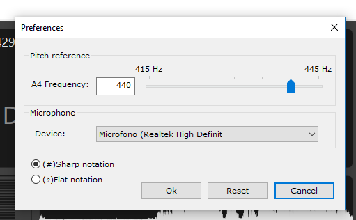

An application for detects and displays the pitch of musical notes played on a musical instrument.

 
                   

The application provides a dialog box for set the user preferences, such as:
 * the frequency of A4;
 * the input device;
 * the notation tu use for display the note.  

## Getting Started

## Deployment

## Built With

### Authors

* **Mario Randazzo** - *Initial work* - [MR6996](https://github.com/MR6996)

### License

This project is licensed under the GNU GPL License - see the [LICENSE](LICENSE) file for details

## References
[1] **P. McLeod and G. Wyvill. A smarter way to find pitch.** In Proceedings of the International Computer Music Conference (ICMC’05), 2005.

Copyright © 2018 Mario Randazzo
