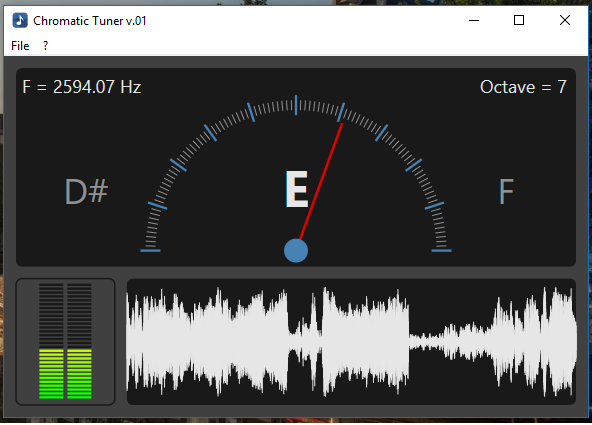

   

The aim of the project have been the production of an application that a musician can use for tune his instruments. 

This application use a Pitch Detection Algorithm (MPM algorithm [See references](#references)), for identify the pitch of a sound recorded by the microphone. This implementation runs in real-time recording audio signal for a small delta of time and applaying the algorithm.

The User-Interface show to the user the nearest note calculated starting from the pitch identified.

   

The application provides a dialog box for set the user preferences, such as:
   * the frequency of A4;
   * the input device;
   * the notation tu use for display the note.
   
  

## Getting Started

## Deployment

## Built With 

### Authors

* **Mario Randazzo** - *Initial work* - [MR6996](https://github.com/MR6996)

### License

This project is licensed under the GNU GPL License - see the [LICENSE](LICENSE) file for details

## References
[1] **P. McLeod and G. Wyvill. A smarter way to find pitch.** In Proceedings of the International Computer Music Conference (ICMC’05), 2005.

Copyright © 2018 Mario Randazzo
